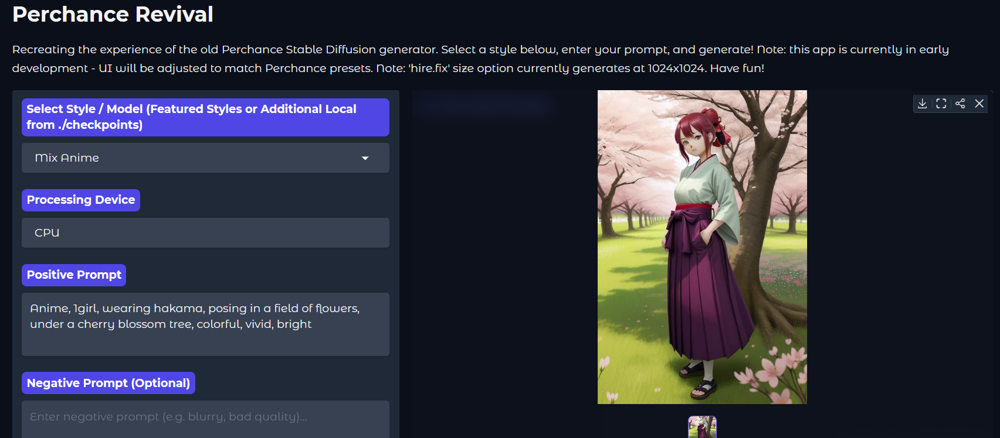

# 08/06/2025 - Issue: update.bat not functioning correctly. To update the update simply download the repo manually and extract, overwriting all in same directory
# 07/06/2025 - Still in Early Dev!

> ⚠️ **Early Development Notice**  
> This app is still in **very early development**. It can already generate images successfully, but expect bugs, missing polish, and future changes (including some big ones). It’s functional but **not production-ready yet**. Stability is good so far, but this is more of an early preview than a final release.


# Perchance Revival - Easy Local SD 1.5 Image Generation

[](https://www.python.org/downloads/)
[](https://opensource.org/licenses/MIT)

Welcome to **Perchance Revival**! This is a user-friendly Gradio web application designed to bring back the experience of the old Perchance image generator by featuring the specific Stable Diffusion 1.5 models and common generation parameters/presets it used.

Generate images effortlessly and for free, directly on your own PC. This version is designed to **prioritize and utilize your NVIDIA GPU** for significantly faster generation if you have one, while still offering a CPU option for broader compatibility. The goal is to make local SD 1.5 generation as simple as possible, especially for those familiar with the old Perchance site.

## Application Screenshot:



This project is primarily designed for **Windows** users, offering a straightforward setup with easy-to-use batch files. Manual setup options are also provided for other platforms or advanced users.


## ✨ Features

- **Device Agnostic:**
  - Run inference on your **CPU**. (inference time around 4:55 with 10th gen i5 — not bad for an oven).
  - Leverage your **NVIDIA GPU** for significantly faster generation (Euler 30 steps = 8 secs with 6GB VRAM). CUDA magic required.
- **Comprehensive Control:**
  - **Positive & Negative Prompts:** Guide the AI with detailed descriptions of what you want (and don’t want).
  - **Inference Steps:** Control the number of denoising steps, because 20 just doesn’t feel lucky enough sometimes.
  - **CFG Scale:** Adjust how strongly the image should conform to your prompt — or not. Live a little.
  - **Schedulers:** Experiment with different sampling algorithms (Euler, DPM++ 2M, DDPM, LMS) until you find your personal flavor of chaos.
  - **Image Sizes:** Choose from standard SD1.5 resolutions, plus a "hire.fix" option (interpreted as 1024x1024 because that's what people usually mean anyway).
  - **Seed Control:** Set a specific seed for reproducible results. Or use -1 and see what the universe decides.
- **User-Friendly Interface:**
  - Clean and intuitive Gradio UI.
  - Organized controls with advanced settings tucked away neatly — like secrets.
  - Direct image display with download and share options.
- **Safety First (Note):** The built-in safety checker is **disabled** in this version to allow for maximum creative freedom. Use responsibly. (We see you.)

## 🚀 Prerequisites
- **Windows Operating System:** The provided batch files (`.bat`) are for Windows. For other operating systems, follow the manual setup steps below (warning: includes actual typing).
- **Python:** 3.8 or higher. Ensure Python is installed and added to your system's PATH (usually an option during installation). You can download Python from [https://www.python.org/downloads/windows/](https://www.python.org/downloads/windows/).
- **Git:** (Required for manual setup and updating) For cloning the repository.
- **Hardware:**
  - A modern CPU is required.
  - For GPU acceleration (optional but highly recommended for speed), a compatible NVIDIA GPU with up-to-date CUDA drivers. At least 6–8GB VRAM is recommended for 512x512 generation, more for larger sizes.
  - **Important:** The correct CUDA version for your drivers is critical. Use `nvidia-smi` in the command prompt to check your driver's compatible CUDA version. Or guess wildly — up to you.
- **Internet Connection:** Required for downloading models from Hugging Face Hub and for updates. Sorry, it doesn't generate dreams offline (yet).

## 📦 Easy Setup (Windows - Download & Run)

This is the recommended and easiest method for most Windows users.

1.  **Download the project:**
    *   Go to the GitHub repository page: `https://github.com/Raxephion/Old-Perchance-Revival-WebUI`
    *   Click the green "<> Code" button.
    *   Click "Download ZIP".
2.  **Extract the ZIP:** Extract the downloaded ZIP file to a location on your computer (e.g., your Documents folder or Desktop). This will create a folder like `Old-Perchance-Revival-WebUI-main` (or similar). You can rename it if you prefer, for example, to `PerchanceRevival`.
3. **Choose Your Setup Script:**
   - **For CPU Inference:** Run `setup-CPU.bat`. This will install the CPU version of PyTorch.
   - **For GPU Inference:** Run `setup-GPU.bat`. This will attempt to install the CUDA-enabled version of PyTorch.
4. **Run the Setup Script:**
   - Navigate into the extracted folder.
   - **Double-click either `setup-CPU.bat` or `setup-GPU.bat`** depending on whether you want CPU or GPU inference.
   - A command prompt window will open. Follow the instructions in the window. This script will create a Python virtual environment (`venv`), install all necessary core dependencies, and install the appropriate version of PyTorch.
   - **Important:** Read the output in the command prompt carefully during and after the script finishes.
     - **If using `setup-GPU.bat` and the CUDA installation fails:** The script will provide instructions on how to troubleshoot the CUDA installation or how to install the CPU version of PyTorch as a fallback. There's no shame in going back to CPU. Okay, maybe a little.


## 🔄 Updating the Application (Windows - Easy Method)
To get the latest code, dependency updates and updated models from this repository after using the easy setup:
- Navigate to the project folder.
- Double-click `update.bat` to run it.
- A command prompt window will open and pull the latest changes from the GitHub repository and upgrade the Python packages in your virtual environment. Congratulations, you are now slightly more modern.


## ▶️ Running the Application (Windows - Easy Method)

Once the setup is complete (including successful PyTorch installation, whether GPU or CPU), launch the Gradio web UI by double-clicking the `run.bat` file in your project folder (e.g., `PerchanceRevival`).

*   A command prompt window will open, activate the environment, and start the application.
*   A browser window should automatically open to the application (or a local URL will be provided in the console, usually `http://127.0.0.1:7860`).


---

## ⚙️ Manual Setup (Windows - Git Clone)

This method is for Windows users who are comfortable with Git.

1.  **Clone the Repository:** Open Command Prompt or PowerShell, navigate to where you want to download the project, and run:
    ```bash
    git clone https://github.com/Raxephion/Old-Perchance-Revival-WebUI.git
    cd Old-Perchance-Revival-WebUI
    ```
    *(Note: You can rename the `Old-Perchance-Revival-WebUI` directory after cloning if you prefer.)*
2.  **Proceed with Batch Files:** Continue by following **Step 2 (Run the Setup Script)**, **Step 4 (Prepare Additional Local Models)** (for your *own* checkpoints), **Running**, and **Updating** instructions from the **📦 Easy Setup (Windows - Download & Run)** section above. Make sure the `images` folder exists and contains `ciphercore01.png` if you use this method and they aren't already in the cloned repo.

## 🛠️ Manual Setup, Running & Updating (For Linux/macOS or Advanced Users)

If you are not on Windows or prefer a manual command-line approach:

1.  **Clone the Repository:**
    ```bash
    git clone https://github.com/Raxephion/Old-Perchance-Revival-WebUI.git
    cd Old-Perchance-Revival-WebUI
    ```
2.  **Create and Activate a Virtual Environment:**
    ```bash
    python -m venv venv
    source venv/bin/activate
    ```
3.  **Install Dependencies (including PyTorch):**
    *   Install core dependencies:
        ```bash
        pip install -r requirements.txt
        ```
    *   Install PyTorch: **This step is crucial and depends on your hardware.**
        *   **For NVIDIA GPU with CUDA (Recommended for speed):** Find the appropriate command for your CUDA version on the PyTorch website: [https://pytorch.org/get-started/locally/](https://pytorch.org/get-started/locally/). Example for CUDA 12.1:
            ```bash
            pip install torch torchvision torchaudio --index-url https://download.pytorch.org/whl/cu121
            ```
        *   **For CPU ONLY (if no NVIDIA GPU or CUDA fails):**
            ```bash
            pip install torch torchvision torchaudio --index-url https://download.pytorch.org/whl/cpu
            ```
4.  **Prepare Additional Local Models (Optional):** Follow Step 4 from the **📦 Easy Setup (Windows - Download & Run)** section above (the part about the `checkpoints` folder for *your own* models).
5.  **Run the Application:**
    ```bash
    python main.py
    ```
    Ensure your virtual environment is activated (`source venv/bin/activate`) before running this command.
6.  **Updating Manually:**
    *   Navigate to the project directory in your terminal (`cd Old-Perchance-Revival-WebUI`).
    *   Ensure your virtual environment is activated (`source venv/bin/activate`).
    *   Pull the latest code: `git pull`
    *   Update dependencies (excluding PyTorch unless you change the `requirements.txt` or manually upgrade): `pip install -r requirements.txt --upgrade`
    *   Deactivate the environment: `deactivate`

## ⚙️ Uninstall:

1.  **Delete the main directory (folder) - this app is completely portable.**


## 📄 License

This project is licensed under the MIT License - see the [LICENSE](https://opensource.org/licenses/MIT) file for details.


## Support:

Feel free to buy me a coffee ;) https://ko-fi.com/raxephion
